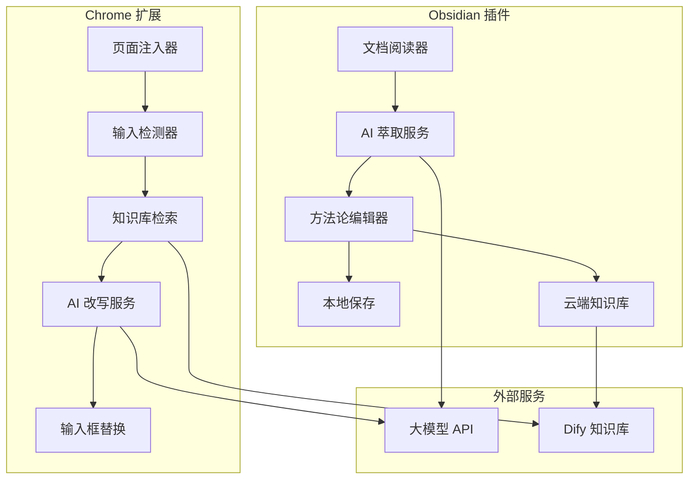
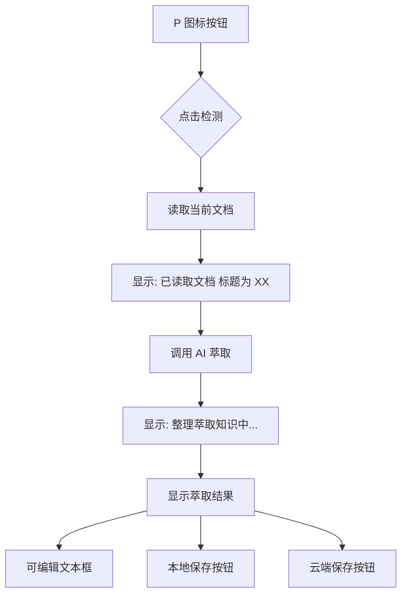
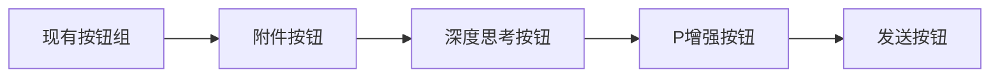
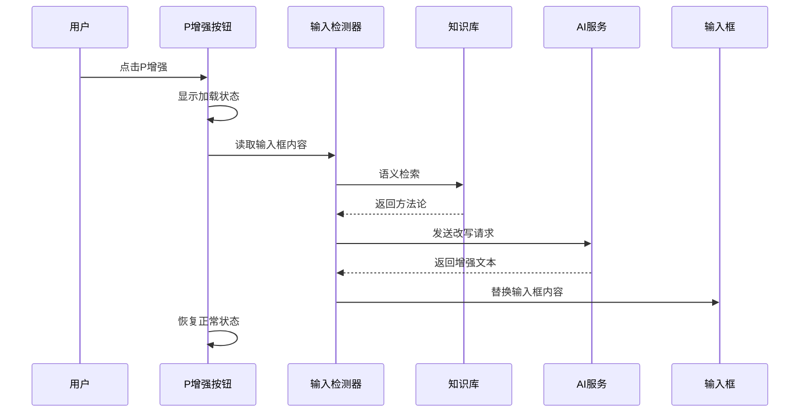
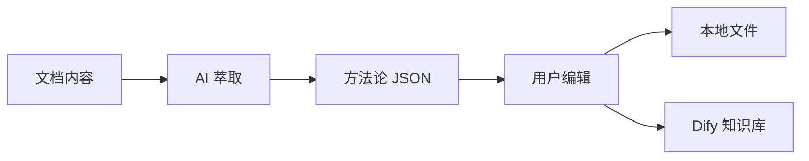
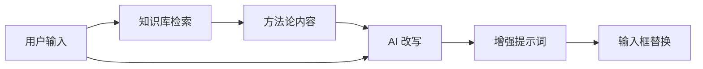

#  batter-prompts 设计文档

> 此文档由 Qoder 根据我的初始设计提示词生成，作为 README 不错。

## 概述

提示词增强系统是一个双平台插件系统，包括 Obsidian 插件和 Chrome 浏览器扩展。系统通过知识萃取和智能检索，帮助用户生成高质量的 AI 提示词。

### 核心功能
- **Obsidian 插件**：从文档中萃取方法论，构建知识库
- **Chrome 扩展**：在 AI 对话网站中增强用户输入，提供方法论支持

### 技术栈
- **Obsidian 插件**：TypeScript + Obsidian API
- **Chrome 扩展**：TypeScript + Chrome Extension API
- **AI 服务**：大模型 API（支持 Moonshot/Kimi 等）
- **知识库**：Dify 知识库系统

## 系统架构



## Obsidian 插件设计

### 用户界面设计

#### 侧边栏插件


#### 状态显示流程
| 状态 | 显示内容 | 用户操作 |
|------|----------|----------|
| 初始状态 | P 图标按钮 | 点击启动 |
| 文档读取后 | "已读取文档，标题为《XX》" | 自动进入下一步 |
| API 调用中 | "整理萃取知识中..." | 等待响应 |
| 结果显示 | **萃取知识如下：**<br/>可编辑文本框<br/>保存按钮 | 编辑并保存 |

### 核心功能模块

#### 1. 文档读取器
```typescript
interface DocumentReader {
  getCurrentDocument(): Promise<string>;
  getDocumentTitle(): string;
  validateDocument(): boolean;
}
```

#### 2. AI 萃取服务
- **系统提示词**：来自 `萃取.md` 文件
- **用户提示词模板**：
  ```
  待萃取方法论的文章：
  <content>
  ${content}
  </content>
  ```
- **响应格式**：JSON 格式的方法论数组

#### 3. 方法论编辑器
```typescript
interface MethodologyEditor {
  displayResult(methodology: string): void;
  enableEditing(): void;
  getEditedContent(): string;
}
```

#### 4. 保存模块
- **本地保存**：在 methodology 文件夹创建文档
- **云端保存**：调用 Dify 知识库 API

### 配置管理

#### 大模型配置
| 字段 | 类型 | 描述 |
|------|------|------|
| Model_Name | string | 模型名称 |
| Base_url | string | API 基础 URL |
| API_KEY | string | 认证密钥 |

#### 知识库配置
| 字段 | 类型 | 描述 |
|------|------|------|
| post_url | string | API 端点 |
| dataset_id | string | 数据集 ID |
| API_Key | string | 认证密钥 |

## Chrome 扩展设计

### 目标网站适配

#### 支持平台
- **DeepSeek**：`#chat-input` textarea
- **Kimi**：`.chat-input-editor` contenteditable
- **豆包**：`[data-testid="chat_input_input"]` textarea

#### 按钮注入位置


### 功能流程

#### 1. 页面注入与检测
```typescript
interface PageInjector {
  detectTargetSite(): SiteType;
  injectEnhanceButton(): void;
  bindButtonEvents(): void;
}
```

#### 2. 输入处理流程


#### 3. 知识库检索
- **检索方式**：语义检索 (semantic_search)
- **不使用 ReRank**：`reranking_enable: false`
- **检索参数**：
  ```json
  {
    "search_method": "semantic_search",
    "reranking_enable": false,
    "top_k": 3
  }
  ```

#### 4. AI 改写服务
- **系统提示词**：来自 `make_prompt.md` 文件
- **用户提示词模板**：
  ```
  用户需求：
  <user_query>
  ${user_input}
  </user_query>
  
  可选方法论支持
  <methodology>
  ${results}
  </methodology>
  ```

### 用户界面

#### 按钮样式适配
- **豆包**：匹配 `.semi-button` 样式
- **Kimi**：匹配 `.icon-button` 样式  
- **DeepSeek**：匹配 `.ds-button` 样式

#### 配置页面
- 独立标签页面（非弹窗）
- 包含大模型和知识库配置
- 提供连接测试功能
- 显示配置提示信息

## 数据流设计

### Obsidian 插件数据流


### Chrome 扩展数据流


## API 集成

### 大模型 API
```typescript
interface LLMService {
  extractMethodology(content: string): Promise<MethodologyResult[]>;
  enhancePrompt(userInput: string, methodology: string): Promise<string>;
}
```

### Dify 知识库 API

#### 添加文档段落
- **端点**：`POST /datasets/{dataset_id}/documents/{document_id}/segments`
- **认证**：Bearer Token
- **请求体**：
  ```json
  {
    "segments": [{
      "content": "方法论内容",
      "keywords": ["关键词1", "关键词2"]
    }]
  }
  ```

#### 检索知识库
- **端点**：`POST /datasets/{dataset_id}/retrieve`
- **认证**：Bearer Token
- **请求体**：
  ```json
  {
    "query": "检索关键词",
    "retrieval_model": {
      "search_method": "semantic_search",
      "reranking_enable": false,
      "top_k": 3
    }
  }
  ```

## 错误处理

### 异常情况处理
| 错误类型 | 处理方式 |
|----------|----------|
| API 连接失败 | 显示错误提示，提供重试选项 |
| 文档读取失败 | 提示用户打开有效文档 |
| 知识库为空 | 提示用户先使用 Obsidian 插件构建知识库 |
| 配置缺失 | 引导用户完成配置 |

### 用户反馈
- 加载状态指示
- 成功/失败提示
- 详细错误信息
- 操作指导建议

## 安全性考虑

### 数据保护
- API 密钥加密存储
- 本地配置文件保护
- 敏感信息脱敏显示

### 权限控制
- 最小权限原则
- 用户授权确认
- 数据访问日志

## 测试策略

### 单元测试
- API 服务模块测试
- 数据处理逻辑测试
- 配置管理测试

### 集成测试
- 端到端流程测试
- 多平台兼容性测试
- API 集成测试

### 用户测试
- 界面易用性测试
- 功能完整性验证
- 性能表现评估
